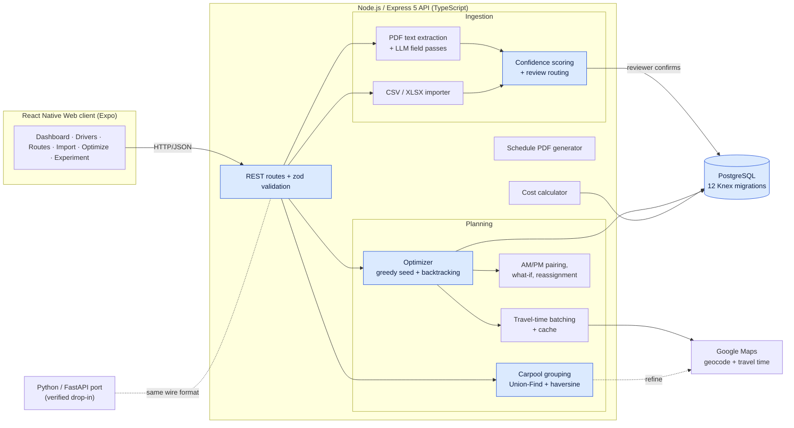

# Dispatch: school-bus route scheduling

Dispatch assigns drivers to student transportation routes. It optimizes for **coverage** first (assign as many routes as possible), then for **efficiency** (fewest total miles). Route data comes from messy PDF manifests, and every extracted row passes a human review step before it reaches the database.

This repository is a runnable extract of the core algorithms from a private full-stack system. The full system is in a private repository; I'm happy to walk through it or grant read access during an interview.

[](https://github.com/GeorgeKhalil123/dispatch-showcase/actions/workflows/ci.yml)

---

## Problem

A small transportation company assigns drivers (CDL holders driving minivans parked at home) to student routes. Each route has an AM leg (home to school) with a hard bell-time deadline, and a PM leg (school to home) with a fixed dismissal time. Doing this by hand is slow and error-prone, and it leaves both coverage and mileage on the table. The routes arrive as inconsistently formatted PDFs and spreadsheets. The goal is to turn those documents into a conflict-free driver schedule that a dispatcher can review, adjust and re-run.

## Architecture (full system)

Highlighted nodes are included in this repository, in simplified form. Everything else is private.



## Key technical decisions

**1. A lexicographic objective instead of a weighted score.** The solver ranks solutions by (routes covered, then total miles, then the heaviest driver's load), in that order. A weighted sum would let enough saved miles outweigh one dropped route. Here, a solution with lower mileage but worse coverage can never win, because miles are only compared once coverage is tied. *Tradeoff:* the objective can't be handed to a linear solver as a single number. It needs a search that compares the three terms directly.

**2. An exact backtracking search with a greedy seed, not a MIP/CP-SAT model.** Each period (AM, PM) is searched separately. Candidates are taken in bell-time order, and each one is either placed on a driver or skipped. Two pruning rules cut the search down: "even assigning everything left can't beat the best so far" and "coverage is already perfect and this branch has more miles". Before the search starts, a greedy nearest-driver pass sets the starting best solution. That makes pruning bite from the first branch. If the 2,000,000-iteration cap is hit, the result is still at least as good as the greedy seed. *Tradeoff:* the worst case is exponential. The periods are solved separately, the seed makes pruning effective early, and the full system can re-optimize just a chosen subset of drivers when an input is too large. The solver's first-found tie-breaks are deterministic. A CP-SAT model could return a different, equally optimal plan and reshuffle drivers' existing schedules for no reason.

**3. Committed assignments stay fixed, and new routes are placed around them.** Existing assignments are not simulated up front, which would block new routes with earlier bells. Instead they join the search as *fixed* candidates locked to their driver. New routes can go before, between or after them. Any branch that would make a preserved route late is pruned. Re-running after adding one route therefore never drops a route that was already scheduled. *Tradeoff:* if the greedy order can't honor a fixed route, the seed is thrown away and the search starts from nothing.

**4. Cheap geometry first, paid travel-time lookups second.** Carpool grouping checks every pair of students for "homes within 1.5 mi" and/or "schools within 2.5 mi" by straight-line distance. Connected students are merged with Union-Find (path compression, union by rank), so grouping is transitive. Only the surviving multi-school groups are checked against real travel times ("schools within 5 minutes"). A group that fails is split back into single-student groups. *Tradeoff:* the 2.5 mi pre-filter is deliberately loose, to avoid false negatives, and transitive merging can chain into a long group. Hence the second check.

**5. Imported rows are reviewed by a person, never committed automatically.** Each extracted row gets two scores. One comes from the extraction passes' own flags (0.9, minus 0.1 per flag, floored at 0.4). The other measures completeness (1.0, minus 0.15 per missing critical field). Final confidence is the **minimum** of the two, so a row is only green if both are high. A row goes to the review queue if confidence is below 0.7 **or** it carries any flag. When a row near a page break is extracted twice, the higher-confidence copy is kept and both copies' flags are merged. *Tradeoff:* reviewers see more rows. In exchange, a misread address never silently becomes a driver's stop.

## Verified numbers (full private system)

| Metric | Value | How it was counted |
|---|---|---|
| TypeScript test files | 14 | `find src -name '*.test.ts' -not -path '*/node_modules/*' \| wc -l` |
| `it()` / `test()` cases | 127 | grep count over those files (not a runner count) |
| Knex migrations | 12 | `01_create_core_tables.ts` through `12_add_driver_pay_type_check.ts` |
| Solver iteration cap | 2,000,000 per period | constant in the optimizer |
| Python/FastAPI port tests | 710 collected | `pytest --collect-only -q` |

The backend was also ported to Python/FastAPI. Its status document records that every endpoint was diffed against the running TypeScript server on the same requests and matched byte for byte. TypeScript is still the default runtime, chosen on solver performance. The Python port source is not included here.

No screenshots are included: the source repository contains no screenshots or GIFs, only app icons.

## What's in this repo vs. private

| In this repo | Kept private |
|---|---|
| `optimizer/feasibility.ts`, `tripHelpers.ts`, `greedySeed.ts`, `types.ts` (close to the originals) | Full `optimize()` orchestration, AM/PM pairing enforcement, what-if scenarios, selective driver reassignment |
| `optimizer/backtrack.ts` + `solve.ts`: the backtracking core and a trimmed `solve()` that takes plain data | Google Maps service, travel-time batching and cost control, geocoder and geocode cache |
| `optimizer/travelTime.ts`: **toy** `HaversineProvider` (straight line at 45 mph) and `MatrixProvider` behind the same `TravelTimeProvider` seam | Live, traffic-aware travel times |
| `grouping/`: Union-Find grouping, haversine pre-filter, travel-time refinement, with the database and Maps decoupled | Cost calculator (pay rates, gas/toll settings) |
| `ingest/`: confidence scoring, dedup and review routing, driven by a **toy** `StubExtractor` returning canned rows | PDF text extraction, extraction prompts and the model call path |
| `api/`: Express 5 app with `validate.ts` middleware and zod schemas; `POST /optimize` and `POST /import/preview` over an in-memory repository | The rest of the REST API, auth, rate limiting, logging, the client app, the PDF schedule generator |
| `db/migrations/`: 3 illustrative migrations adapted from the 12 real ones, tested on SQLite; Postgres-specific statements are gated on the client | Seed data, all real driver, student and school data, real manifests |

Everything under `src/demo/` is synthetic: a made-up town ("Fairview") with 6 drivers, 12 routes (6 AM, 6 PM) and 3 schools.

## Quickstart

Requires Node 22+.

```bash
npm ci
npm run demo        # grouping -> optimization -> import review on the synthetic dataset
npm test            # vitest
npx tsc --noEmit    # typecheck
npx eslint .        # lint
npm run serve       # API on http://localhost:3000
```

Try the API:

```bash
curl -s -X POST localhost:3000/optimize -H 'content-type: application/json' \
  -d '{"date":"2026-09-08","buffer_minutes":10}'

curl -s -X POST localhost:3000/import/preview -H 'content-type: application/json' \
  -d '{"filename":"RT201 Morning.pdf"}'
```

Client errors come back as JSON 4xx (`{"status":…,"message":…}`). Server errors never include a stack trace unless the server is started with `DISPATCH_DEBUG=1`.

Excerpt of `npm run demo`:

```
=== 2. Optimization (greedy seed -> backtracking, buffer 10 min) ======
6 drivers, 12 routes, 1 preserved assignment(s), provider = haversine
[AM] 3 flexible candidate(s): greedy seed 3 covered / 10.99 mi, backtracking 3 covered / 10.99 mi (170 iterations)
[PM] 4 flexible candidate(s): greedy seed 4 covered / 23.72 mi, backtracking 4 covered / 20.48 mi (852 iterations)

AM  rt-106-am   Driver 4  (preserved)
AM  rt-103-am   Driver 2    3.18 mi   4 min
...
{"total_routes":12,"assigned":10,"unassigned":0,"flagged_skipped":2,"total_estimated_miles":31.47,"total_estimated_minutes":41,"drivers_used":4}

=== 3. Import preview (stub extractor, review routing) ================
RT201 Morning.pdf: 4 row(s), 3 need review
REVIEW Student 21  conf=0.90  Row split across page break
REVIEW Student 22  conf=0.85  Missing end time
REVIEW Student 23  conf=0.60  Address partially illegible; Unit number unclear; Time column shifted; Model uncertainty: 60%
ok     Student 24  conf=0.90
```

(Miles come from the toy straight-line provider, so they are illustrative only.)

## Layout

```
src/
  optimizer/   feasibility, trip helpers, greedy seed, backtracking, solve(), travel-time providers
  grouping/    Union-Find carpool grouping + travel-time refinement
  ingest/      confidence scoring, dedup, review routing, StubExtractor
  api/         Express app, validate middleware, zod schemas, in-memory repository
  db/          illustrative Knex migrations + static migration source
  demo/        synthetic dataset and `npm run demo`
  shared/      domain types, haversine
```

## Tests

`npm test` runs 129 tests across 10 files. The feasibility, greedy-seed, trip-helper and validate-middleware tests are ported from the private repo. The grouping tests were rewritten to run without the database mock. The solver, confidence, API (supertest) and migration (Knex on in-memory SQLite) tests were written for this extract. CI runs typecheck, lint and tests on Node 22.

## Known limitation (inherited)

Drivers can only chain candidates in bell-time order, and candidates with the *same* bell keep their load order (routes are loaded sorted by start time). If two routes share a bell, the solver only considers one of the two possible chaining orders.

## License

MIT. See [LICENSE](LICENSE).
